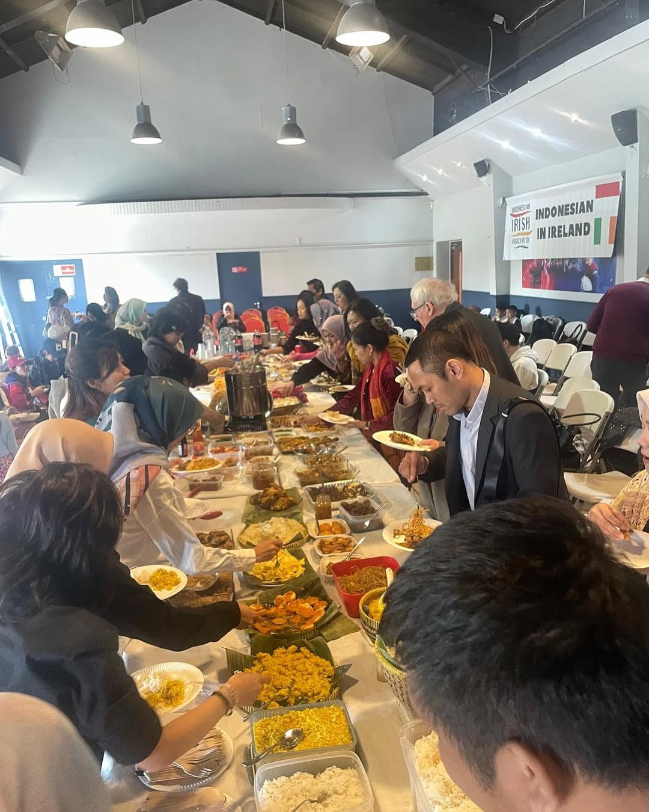
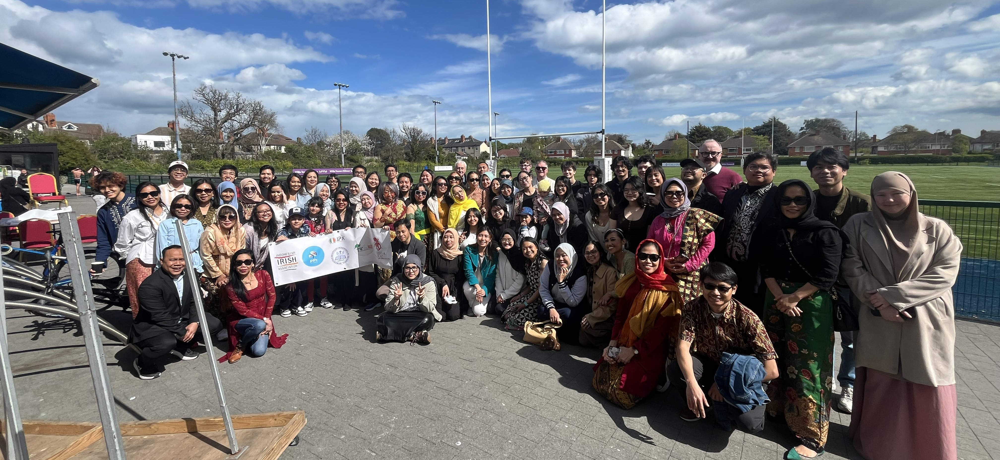

Halal bihalal is an event that’s become a beloved tradition for the Indonesian community in Ireland, and this year was no exception. Held on 13 April 2025 at Clontarf Rugby Club in Dublin, it was a day full of warmth, good food, and great company. PPI Irlandia teamed up with a number of organizations to make the event extra special, including the Indonesia-Irish Association (IIA), Firdaus (Indonesian Islamic community), KONKRIID (Indonesian and Catholic Indonesian community), and Perempuan Berkebaya Indonesia (PBI). These collaborations helped create an inclusive atmosphere, bringing together people from all walks of life.

A special highlight of the day was the presence of His Excellency Wan Aznainizam Yusri Wan Abdul Rashid, the Ambassador of Malaysia, who joined us as a guest of honor. We were also lucky enough to hear welcoming remarks from the Indonesian Embassy for the UK and Ireland, delivered by Ms. Sahadatun Donatirin, Deputy Chief of Mission at the Indonesian Embassy in London.

The weather couldn’t have been better, sunny and perfect for a group photo! We had extraordinary amount of Indonesian dishes available, all prepared by the Indonesian diaspora and students. With over 70 participants from across Ireland, the event was a huge success, and it was a wonderful reminder of the strength and unity of the Indonesian community here in Ireland. 

Until we meet again next year!

#### Any questions or inquiries? 
Email organizers at [ppi.irlandia@ppi.id](mailto:ppi.irlandia@ppi.id)